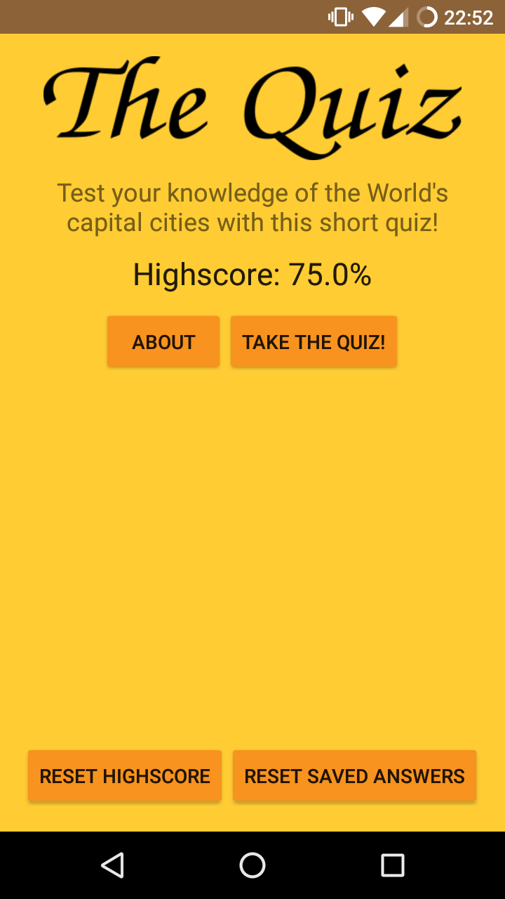
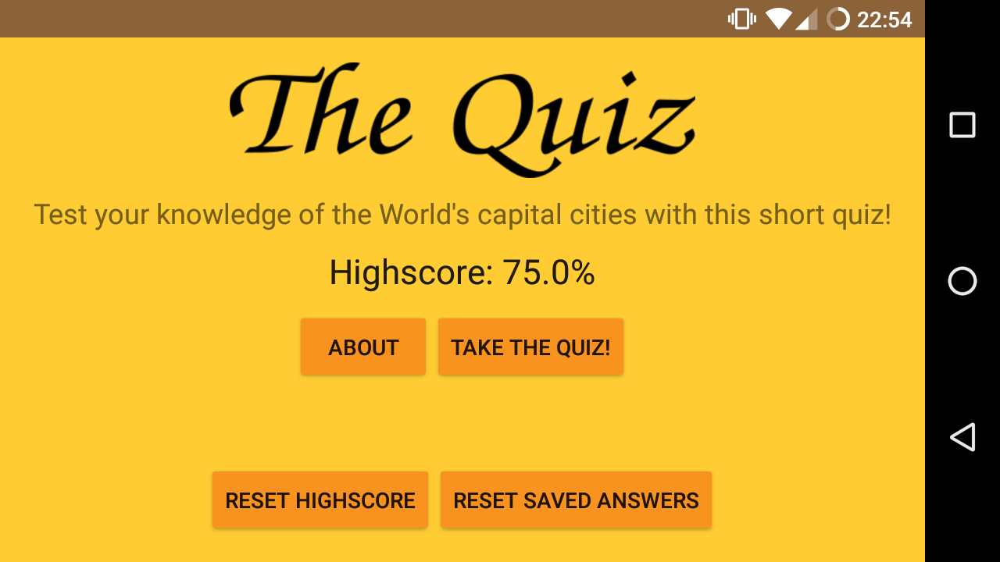
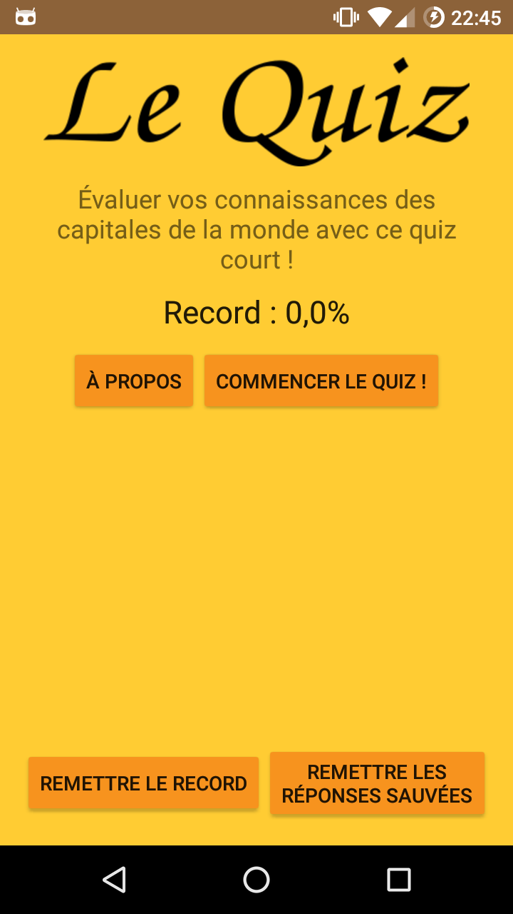
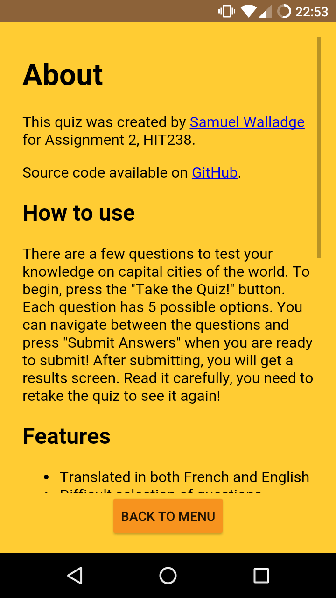
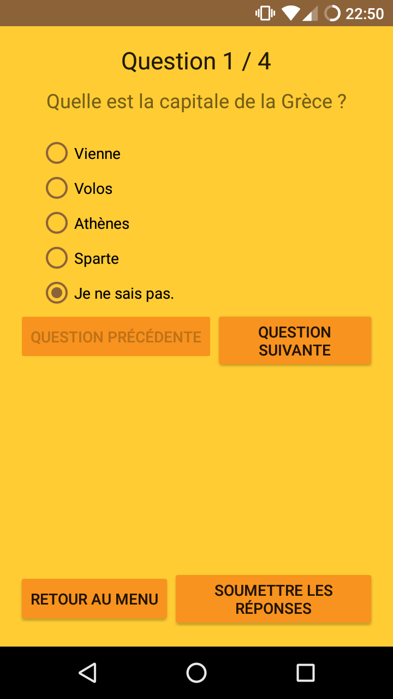
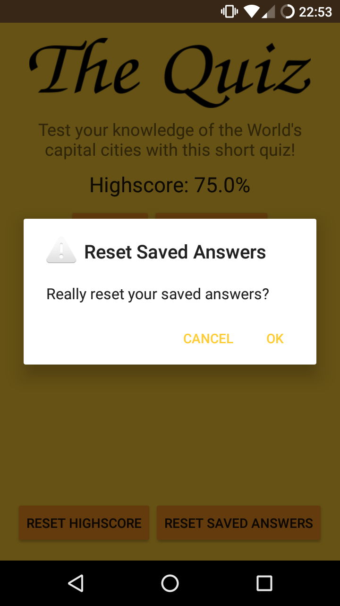

# quiz-android

## Copyright © 2016 Samuel Walladge

Simple native android quiz app for testing your knowledge on capital cities.

## INFO

- the app has been developed using Android Studio
- minimum api set is api 19 (kitkat), although looks best on api 21 (lollipop) and higher due to extra styles available
- source code available on GitHub at [swalladge/quiz-android](https://github.com/swalladge/quiz-android)

## FEATURES

Within original requirements:

- contains a banner image on the main activity to announce itself
- ability to reset your saved answers and highscore
- contains 15 questions
- automatically saves answers while taking the quiz for resuming later
- results screen gives feedback on individual answers (including showing correct answer in cases where you gave the wrong answer)
- counts and displays your score (percentage of correct answers)
- all questions are multiple choice and include a "don't know" option
- webview for an "about" page

Extra features:

- stores the highscore (Beat your previous score! Compete with your friends!)
- back button overridden where required to make it more useful within the app
- custom launcher icon with support for a range of different dpi
- confirmation dialogs for major actions (reset answers, submit quiz, etc.)
- full localization support with use of resources (for strings, images, and files)
- French translation included

## SCREENSHOTS

### Main activity

### Also with landscape

### And main activity in French

### About view

### Question view (French)

### With warning dialogs when needed

## LICENSE

    This program is free software: you can redistribute it and/or modify
    it under the terms of the GNU General Public License as published by
    the Free Software Foundation, either version 3 of the License, or
    (at your option) any later version.

    This program is distributed in the hope that it will be useful,
    but WITHOUT ANY WARRANTY; without even the implied warranty of
    MERCHANTABILITY or FITNESS FOR A PARTICULAR PURPOSE.  See the
    GNU General Public License for more details.
